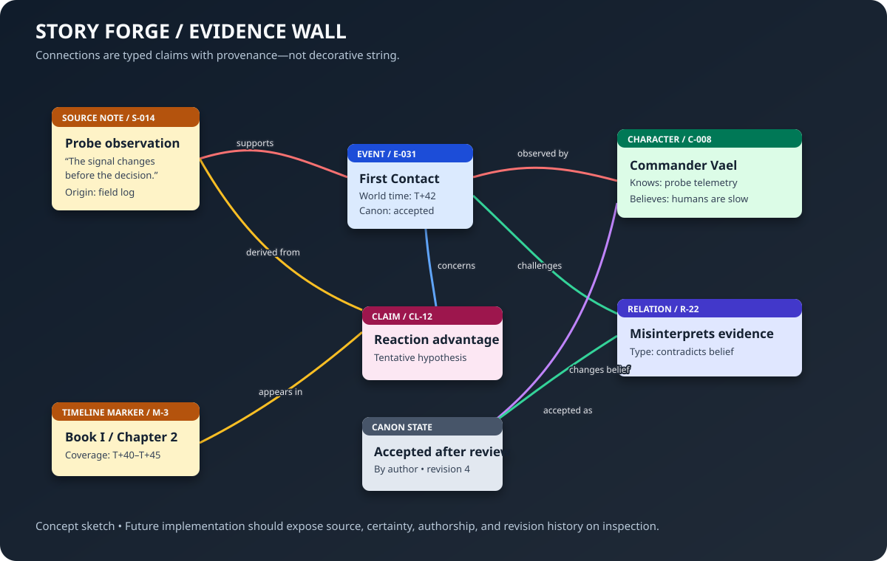

# Story Forge — Temporal Story Data and Diegetic Authoring

Story Forge is a capability inside the Forge Experience. It is not a separate host application and does not replace FSM_COS, FSM_API, the MicroBundle contracts, or a future renderer. The Experience describes the authoring capability; manifestations decide how to present it.

## The core idea

A story is a connected model of entities, events, claims, relationships, and time—not only a sequence of paragraphs. Prose is one expression of that model.

The same canonical data can support a string-board investigation surface, a named timeline with clickable event markers, character dossiers, maps and spatial observations, chapter/episode/volume coverage overlays, temporal playback, immersive scene manifestation, continuity analysis, and multiple output formats.

## Story time and publication coverage must stay separate

A story-time axis answers: **“What does the story model say was happening at time t?”**

A publication-coverage axis answers: **“Which story-time interval does this chapter, episode, or edition present?”**

Publication order is a third dimension. A flashback may appear late in Book I while depicting an early point in world history. Adding a new earlier event must not move an already published edition's boundaries or rewrite its content hash.

### Temporal model

- A StoryTimeline gives a timeline its stable identifier, display name, unit, and tick interval.
- A StoryTime is a coordinate on that named timeline, not a wall-clock timestamp.
- A TimelineMarker points to a story object or event.
- A StoryTimeRange is a half-open interval [start, end).
- A PublicationCoverage associates a work unit with the story-time interval it presents.
- A PublishedEdition captures an immutable edition identifier, version, content hash, and declared coverage.

The first domain library implements these small types only. It intentionally does not yet claim to answer arbitrary world-state queries, infer character positions, or optimize camera placement.

## Asking what was true at time t

The planned query pipeline should keep fact retrieval separate from scene composition:

1. The user selects a coordinate on a named timeline.
2. A temporal query resolves candidate events, entity states, and spatial facts at that coordinate.
3. Results preserve provenance and certainty: asserted, inferred, unknown, contradicted, or not applicable.
4. A scene planner selects relevant entities and events for the user's chosen focus.
5. A viewpoint planner may score candidate camera locations or angles for visibility, activity, diversity, and useful non-uniformity.
6. The manifestation renders the scene and exposes timeline markers as interactive navigation back to source records.
7. Playback advances the selected time coordinate and repeats the query, rather than merely moving a decorative camera through an unrelated animation.

Camera orientation and activity scoring are derived presentation choices, not canonical story facts. The user must be able to inspect why a view was chosen and override it.

## Timeline visualization requirements

- Draw a true 2D axis with explicit tick marks, readable scale, and stable coordinates.
- Let authors name and configure timelines; do not assume every project uses seconds or years.
- Make event markers selectable and keyboard-accessible, with meaningful labels and details.
- Support zooming and panning without changing canonical time values.
- Show multiple coverage bands for chapters, books, episodes, cuts, or editions.
- Permit overlapping, nested, disjoint, and out-of-order story-time coverage.
- Distinguish unpublished working coverage from immutable published-edition coverage.
- Provide a time scrubber and play/pause/step controls for scene manifestation.
- Never conflate a timeline's display layout with its data model.

## Character workshop

Characters should be authored as structured entities with identity, names and aliases, descriptions, appearance, capabilities, motivations, relationships, knowledge, state history, and provenance. These should be extensible rather than fixed to a single character template.

Events should link to affected entities. A character dossier can then show the events involving that character and the times at which traits, possessions, relationships, knowledge, or location change.

## Canon, proposals, and provenance

Extracted material and model-generated suggestions are proposals until a human accepts them. Preserve source references, authorial decisions, confidence where appropriate, and the distinction between confirmed canon, tentative ideas, discarded alternatives, and intentional mysteries.

External research must respect access permissions, attribution, and copyright. The tool should retain provenance and support short, attributed notes rather than silently copying source material into the story corpus.

## Immutable publication

A published edition is a snapshot with stable identity and content hash. Subsequent authoring can add earlier events, revise working coverage, or create a new edition. It must not mutate the previous edition's identity, bytes, or declared coverage.

A future repository-backed publication path should reuse the Workshop's existing artifact and manifest contracts rather than inventing a parallel publishing system.

## Proposed dependency direction

The Story Forge domain project is deliberately dependency-free. Add package dependencies only after verifying the relevant current contracts and selecting a concrete consumer. FSM_COS remains the composition boundary; renderer-specific camera and GUI concepts must not leak into the story domain.

## Implementation sequence

1. Establish the domain vocabulary and validation rules.
2. Add unit tests for time domains, ranges, coverage, and edition immutability.
3. Add a query interface for events and entity state at time t, including uncertainty and provenance.
4. Build a renderer-independent timeline model and illustrative SVG examples.
5. Create the diegetic timeline manifestation with clickable markers and coverage lanes.
6. Add character and event authoring, then the evidence/string board.
7. Add scene composition and explainable viewpoint scoring.
8. Add temporal playback.
9. Integrate as a manifest-driven Forge capability after confirming the existing Experience startup and MicroBundle contracts.

The first milestone is not a beautiful fake timeline. It is a correct temporal model that can support several beautiful views without changing the story.
