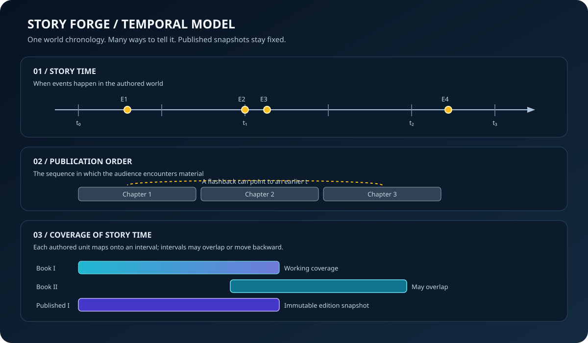

# Story Forge

Story Forge is a code-defined Experience capability for capturing a story as connected, queryable data and expressing that data through different media.

This first library is intentionally renderer-independent and dependency-free. It establishes domain vocabulary before any GUI, camera, rendering engine, or authoring host is coupled to it.

## Core distinction: two kinds of time

- **Story time** describes when an event happens in the world being authored.
- **Publication coverage** describes which portions of story time are presented by a chapter, episode, volume, scene, or published edition.

These are different timelines. A later author can add a newly discovered earlier event without silently rewriting an already published book. New editions may intentionally cover different intervals; a published edition's identity and coverage are immutable.

## First concepts

- Named timelines with an explicit time domain and tick interval.
- Markers that refer to events or other story objects.
- Coverage ranges that describe the story-time interval expressed by a work.
- Edition snapshots that retain a fixed identity and fixed coverage.
- Observation queries that ask what the story world says was true at a selected time.

A future diegetic timeline manifestation can draw a hashed axis, selectable event markers, chapter/volume coverage bands, and playback controls from these concepts. The visual layer will query the data; it will not own the canonical story.

## Design principles

1. **Data before depiction.** The same story can be shown as a timeline, string board, dossier, map, novel, screenplay, or immersive scene.
2. **Time is named and typed.** Story time is not publication order, editing time, or wall-clock time.
3. **Queries return evidence.** A temporal query should distinguish known facts, inferred values, unknown values, and conflicting accounts.
4. **Canon has provenance.** Extracted or model-proposed information is not automatically accepted as canon.
5. **Publication is a snapshot.** Editing the source story does not mutate a published edition.
6. **Camera is a consumer.** Spatial observation and camera placement belong to a manifestation or observation service, not to timeline semantics.
7. **No forced ontology.** Projects may define their own time domains, calendars, scales, and ontologies.

## Status

Early foundation only. This project does not yet implement the interactive timeline, story graph, temporal simulation, camera optimization, extraction pipeline, or publishing workflow. Those should be added as separately testable capabilities.
